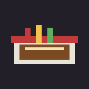

# 🍜 RAMEN-YA / らーめん屋

A small **2D pixel-art open-world** game **DEMO**, built with **Godot 4.x**, in the spirit
of *Stardew Valley*: walk the chef freely around a procedurally-drawn tile map with a
follow-camera, then step into the ramen shop to cook.
All graphics are drawn procedurally in code (the only art asset is the chef spritesheet),
so the project is tiny and exports cleanly to the **Web (HTML5)**.



## 🎮 How to play

### Overworld (`scenes/World.tscn` — the main scene)
Walk the chef along a **commercial street (商业街)** — a paved road with sidewalks, lined
with a row of tall buildings whose ground floors are shops. The **ramen shop** is one of
them: the storefront (底商) with a red-and-white awning and the 拉麵 sign. Walk up to its
door (the neighbouring shops are just for scenery). Right next to it stands the **紫金大廈**
(Purple-Gold Tower) — walk into its open black gate (`E` / tap) for a little side room.

### Inside 紫金大廈 (`scenes/Tower.tscn`)
A walkable hall where small monsters (小怪) roam. **Click a monster to attack it — two hits
defeats it** (it shows 2 HP pips). Walk with `WASD` / click-to-move; leave by the door
(`E` / tap / `ESC`).

| Action | Control |
|---|---|
| Move | `W A S D` / arrow keys, **or click / tap** where you want to walk |
| Enter the shop | `E` at the door, **or click / tap the door** |

> Click-to-move makes the game fully playable with mouse or touch (no keyboard needed) —
> handy on the Web build.

### Shop interior (`scenes/Shop.tscn`)
Stepping through the door drops you into a walkable **tall, narrow room** — wooden floor,
**booths down both walls** (some with diners already eating) and a central aisle, a service
**counter (档口)** at the top and
the exit door at the bottom. The camera scrolls vertically as you walk its length. Step up
to the counter to start cooking, or back to the door to leave.

| Action | Control |
|---|---|
| Move | `W A S D` / arrow keys, **or click / tap** |
| Start cooking | walk to the **counter** + `E` (or **tap the counter**) |
| Leave to the map | walk to the **door** + `E` (or **tap the door**) — also `ESC` / `M` |

### At the counter (the cooking minigame — `scenes/Main.tscn`)
You assemble a bowl of **beef ramen (牛肉麵)** with a *pick-up → put-down* flow. Every
bowl always needs the base: **湯 (soup) + 麵 (noodles) + 牛肉 (beef)**. Each customer
only asks whether to add **蔥花 / 香菜 / 辣椒** — match their order exactly and serve before
their patience runs out.

| Action | Control |
|---|---|
| Start / restart | `SPACE` / `Enter` / click |
| Select a customer | click their seat |
| **Pick up** an ingredient | click a station: 湯鍋 / 麵鍋 / 牛肉片 / 蔥花 / 香菜 / 辣椒 |
| **Put it in** the bowl | click the central **組裝碗** (it follows your cursor while held) |
| Serve | **上菜** button |
| Tip out & restart the bowl | **倒掉** button |
| Back to the shop | **← 店內** button (top-right), or `ESC` / `M` |

**Rules**
- A correct bowl = 湯 + 麵 + 牛肉, **plus exactly** the toppings the customer wants
  (no missing, no extra).
- Correct serve → tip (bigger the faster you serve). Wrong serve → −￥30 & −1 reputation.
- A customer whose patience hits zero leaves angry → −1 reputation.
- Lose all 3 reputation **or** survive the 120-second day to end the shift.

## 📂 Project layout

```
ramen-ya/
├── project.godot          # engine config (GL Compatibility renderer — best for Web)
├── export_presets.cfg     # ready-made "Web" export preset → build/index.html
├── icon.svg
├── scenes/World.tscn      # MAIN scene — open-world map (Node2D + follow Camera2D)
├── scripts/World.gd       # tile map, player movement, collision, camera, shop trigger
├── scenes/Shop.tscn       # walkable shop interior (tables, chairs, counter)
├── scripts/Shop.gd        # interior room, furniture, counter + door interactions
├── scenes/Main.tscn       # the counter cooking minigame
├── scripts/Main.gd        # cooking state machine + pixel rendering
├── assets/                # chef walk spritesheet (+ env art)
└── build/                 # web export output goes here
```

## ▶️ Run it (editor)

1. Install **Godot 4.3+** (standard, not .NET): https://godotengine.org/download
2. Open Godot → **Import** → select `project.godot` in this folder.
3. Press **F5** (Play).

## 🌐 Export to Web (HTML5)

### Option A — from the editor
1. First time only: **Editor → Manage Export Templates → Download and Install**
   (matches your Godot version).
2. **Project → Export…** → the **Web** preset is already configured →
   **Export Project** → save as `build/index.html`.

### Option B — command line (headless)
```bash
# from the project folder, with export templates installed
godot --headless --export-release "Web" build/index.html
```

### Serve the export locally
Browsers won't run the game from `file://` (and it needs cross-origin isolation headers),
so serve it over HTTP:

```bash
cd build
python3 -m http.server 8000
# open http://localhost:8000
```

> The export preset already enables **cross-origin isolation headers** for PWA hosting.
> If you self-host elsewhere, make sure the server sends:
> `Cross-Origin-Opener-Policy: same-origin` and
> `Cross-Origin-Embedder-Policy: require-corp`
> (Godot ships `coi-serviceworker` to help when you can't set headers — or just use
> `python3 -m http.server` locally for testing).

## 🛠️ Tech notes
- Renderer: **GL Compatibility** (OpenGL ES 3 / WebGL2) — the most reliable choice for Web.
- Display: **portrait 270×480** base canvas, `canvas_items` stretch with `keep` aspect →
  crisp pixels (built for a tall phone screen).
- All in-game text is **Traditional Chinese (繁體中文)**, rendered with the pixel font
  **Zpix / 最像素** (`assets/fonts/zpix.ttf`, antialiasing off). The font is **subset** to
  only the glyphs the game uses (~33 KB instead of 7 MB) to keep the Web build small.

- **8-bit BGM**: a square-wave chiptune loop synthesized by
  `assets/audio/generate.py` (NumPy → WAV), played by the `Music` autoload so
  it carries across scene changes. Press **`0`** to mute/unmute. (On the Web
  build, browsers start audio only after your first click/key.)

## 🎨 Credits
- UI font: **Zpix（最像素）** by SolidZORO — https://github.com/SolidZORO/zpix-pixel-font
- All other art is procedurally generated pixel-art (`assets/world/generate.py`,
  `assets/shop/generate.py`) plus the chef walk spritesheet.

---
Demo scaffold — extend it with new recipes, day/night cycles, upgrades, sound, etc. 🍜
